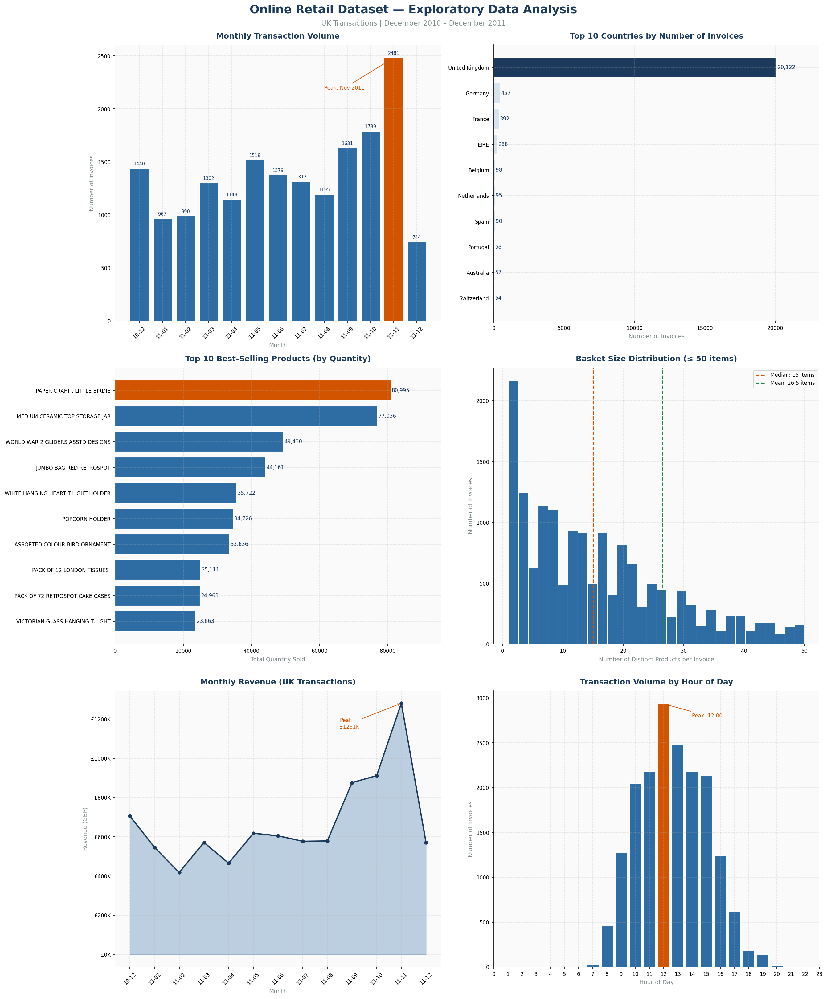
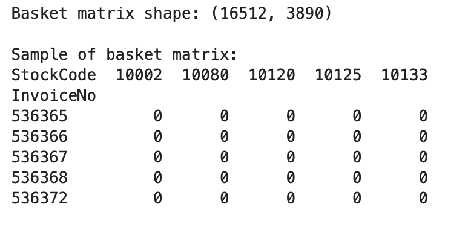
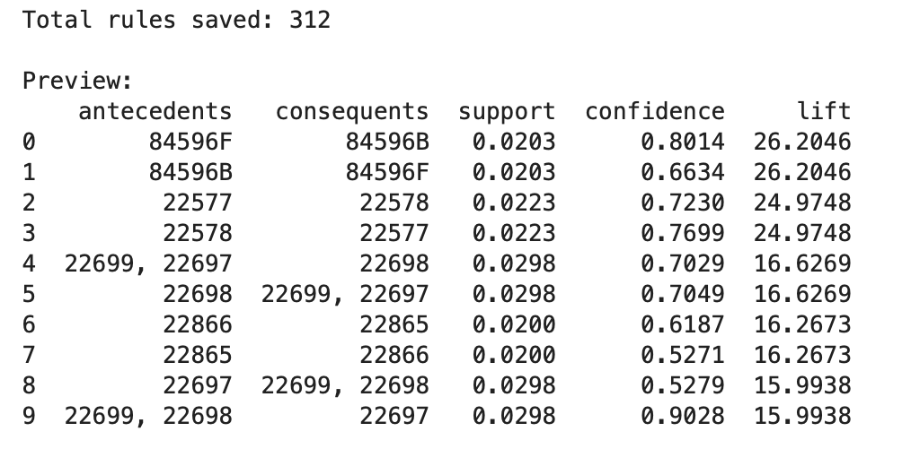
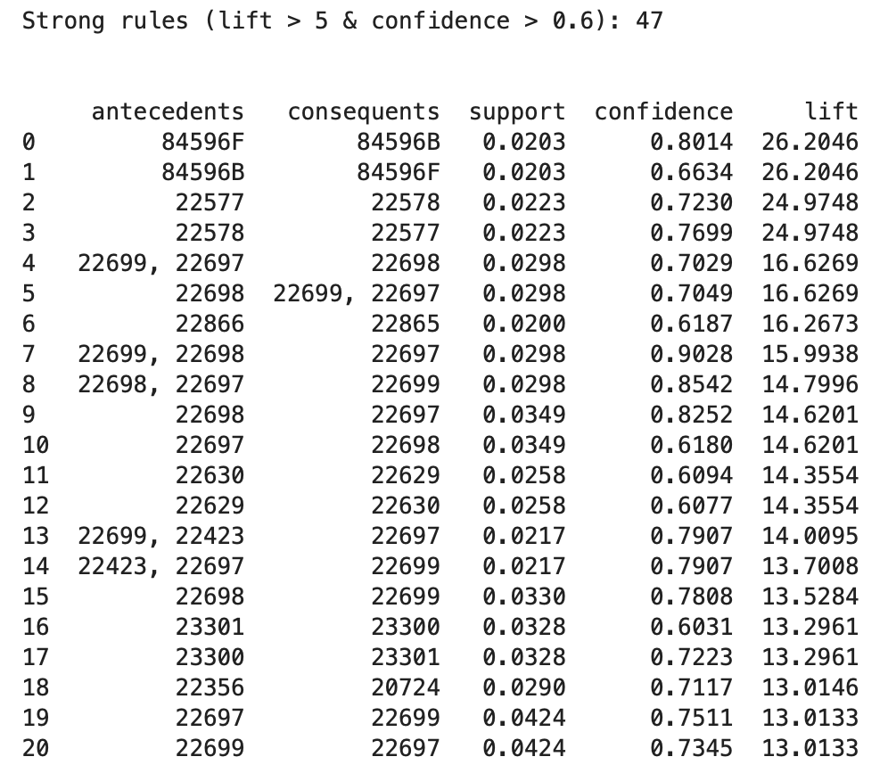

# Market Basket Analysis Report
## Part 1 — Association Rule Mining
### Coventry University | Master of Science in Data Science
### Index No: COMScDS25.2P-001
### Name: Chamika Subashinie
### Github Link: https://github.com/chamikaKity/data_mining/tree/main

---

**Dataset:** Online Retail Dataset (UCI Machine Learning Repository)  
**Period:** December 2010 – December 2011  
**Retailer:** UK-based Online Gift Store  
**Algorithm:** Apriori (mlxtend, Python)  
**Language:** Python 3  

---

## Table of Contents

1. [Objectives](#1-objectives)
2. [Dataset Description and Preprocessing](#2-dataset-description-and-preprocessing)
3. [Rule Mining Process](#3-rule-mining-process)
4. [Resulting Rules](#4-resulting-rules)
5. [Recommendations](#5-recommendations)

---

## 1. Objectives

Association Rule Mining (ARM) is an established data mining technique used to uncover hidden and meaningful relationships between products within large transactional databases. The transactional dataset used in this study belongs to a UK-based registered online gift retailer whose customer base includes a significant proportion of wholesalers. Therefore, market basket analysis can provide several high-level strategic benefits, such as improving the operational, marketing, and commercial performance of the business.

### 1.1 Increased Revenue through Cross-Selling

By identifying products that are frequently purchased together, the retailer can create effective cross-selling strategies. Recommending complementary products during the purchasing process encourages customers to add more items to their basket. This helps increase the average order value without spending extra money on acquiring new customers, ultimately improving overall revenue.

### 1.2 More Effective and Targeted Marketing Campaigns

Instead of using broad promotional campaigns for all customers, the retailer can create targeted promotions based on product purchasing patterns. For example, if a customer buys one product that is often purchased together with another item, the retailer can offer a discount on the related product. This approach makes marketing more effective by focusing promotions on customers who are more likely to buy the recommended items, leading to a better return on marketing investment.

### 1.3 Smarter Website Design and Product Recommendations

As an online-only retailer, the website is the main shopping platform for all customers. By identifying products that are frequently purchased together, the retailer can introduce a product recommendation system such as the “Customers Also Bought” feature. This helps customers quickly find related products, improves their shopping experience, and increases the chances of purchasing multiple items.

### 1.4 Improved Inventory and Supply Chain Management

Products that are frequently bought together should be stocked in a coordinated way. If one item in a closely related pair is out of stock, it can lead to a loss of sales for both products, as customers may not be able to complete their intended purchase. Aligning inventory planning with these product relationships helps reduce stock issues and prevents potential revenue loss.

### 1.5 Better Wholesale Customer Retention and Satisfaction

Since many of the retailer’s customers are wholesalers who buy in bulk, these product relationships can be used to create tailored bundle packages. Offering pre-made product combinations based on common buying patterns makes it easier for wholesalers to place orders, encourages them to purchase more items at once, and helps improve customer satisfaction and long-term loyalty.

---

## 2. Dataset Description and Preprocessing

### 2.1 Dataset Overview

The Online Retail dataset was sourced from the UCI Machine Learning Repository (Chen, Sain & Guo, 2012). It is a transactional dataset containing all purchases made between 1 December 2010 and 9 December 2011 from a UK-based, non-store online retailer. The company specialises in unique, all-occasion gift products, and a notable portion of its customer base consists of wholesalers.

In its raw form, the dataset contains **541,909 rows** and **8 attributes**, with each row representing a single line item within a customer transaction.

| Attribute | Type | Description |
|---|---|---|
| InvoiceNo | Nominal | Unique transaction identifier. A leading 'C' indicates a cancellation. |
| StockCode | Nominal | Unique 5-digit product code. |
| Description | Nominal | Product name. |
| Quantity | Numeric | Number of units purchased per line item. |
| InvoiceDate | Numeric | Date and time of the transaction. |
| UnitPrice | Numeric | Price per unit in GBP (£). |
| CustomerID | Nominal | Unique customer identifier. |
| Country | Nominal | Country of the customer. |

**Table 1: Dataset Attributes**

---

The key column for Market Basket Analysis is: 
- **InvoiceNo** — it groups items into baskets (transactions).
- **Description** or **StockCode** - it tells us what was in each basket.

A **"basket"** = one shopping trip = one transaction = one **InvoiceNo.**
So the **InvoiceNo groups all the items a single customer bought in one visit**. 

For example:
| InvoiceNo | Description |
|---|---|
| 536365 | WHITE HANGING HEART T-LIGHT HOLDER |
| 536365 | WHITE METAL LANTERN |
| 536365 | CREAM CUPID HEARTS COAT HANGER |
| 536366 | KNITTED UNION FLAG HOT WATER BOTTLE |
| 536366 | RED WOOLLY HOTTIE WHITE HEART |

**Invoice 536365** is one basket containing 3 items, and **Invoice 536366** is a different basket with 2 items.

**InvoiceNo = one basket**, and the whole analysis is built around finding patterns within and across those baskets.

---

### 2.2 Preprocessing Steps

Association rule mining requires data to be in a specific binary basket format — a matrix where each row represents a transaction and each column represents a product, with values of 1 (purchased) or 0 (not purchased). The raw dataset required significant preprocessing before this transformation could be applied. The following steps were applied sequentially, each with a specific justification.

---

#### Step 1: Remove Cancellation Transactions

**Action:** Removed all rows where `InvoiceNo` begins with the letter 'C'.

**Rows removed:** 9,288 | **Rows remaining:** 532,621

**Reason:** Cancellations represent reversed transactions, the customer either returned goods, made an error, or changed their mind. These do not reflect genuine purchasing decisions. Retaining them would introduce false associations and artificially inflate the frequency of certain items, distorting both the support values and the rules generated.

```python
df = df[~df['InvoiceNo'].astype(str).str.startswith('C')]
```

---

#### Step 2: Remove Negative and Zero Quantities

**Action:** Removed all rows where `Quantity ≤ 0`.

**Rows removed:** 8,872 | **Rows remaining:** 523,749

**Reason:** Negative quantities represent product returns, adjustments, or corrections, not purchases. Zero quantities add no transactional information. As the minimum Quantity in the raw data was -80,995, these entries clearly represent stock corrections or system adjustments rather than retail transactions.

```python
df = df[df['Quantity'] > 0]
```

---

#### Step 3: Remove Zero or Negative Unit Prices

**Action:** Removed all rows where `UnitPrice ≤ 0`.

**Rows removed:** 1,836 | **Rows remaining:** 521,913

**Reason:** Products with a unit price of zero or below likely represent free samples, system test entries, or administrative adjustments. They do not reflect genuine commercial transactions and would introduce noise into the association analysis.

```python
df = df[df['UnitPrice'] > 0]
```

---

#### Step 4: Remove Non-Standard Stock Codes

**Action:** Retained only rows where `StockCode` matches the standard format of at least five leading digits (regex: `^\d{5}`).

**Rows removed:** 2,942 | **Rows remaining:** 518,971

**Reason:** The dataset contained non-standard StockCode entries including `POST` (postage), `DOT`, `BANK CHARGES`, `AMAZONFEE`, `PADS`, `CRUK`, `M`, `D`, and `S`. We found 33 non-standard codes. These represent service charges, administrative entries, and non-product transactions. Including them would generate meaningless rules such as "customers who buy products also pay postage." Only genuine product codes matching the five-digit standard were retained.

```python
df = df[df['StockCode'].astype(str).str.match(r'^\d{5}')]
```

---

#### Step 5: Remove Duplicate Rows

**Action:** Removed exact duplicate rows using `drop_duplicates()`.

**Rows removed:** 4,955 | **Rows remaining:** 514,016

**Reason:** Exact duplicate rows, identical across all eight columns are likely caused by data entry errors or system logging duplications. They would artificially inflate item frequencies and support values, leading to misleading rules.

```python
df = df.drop_duplicates()
```

---

#### Step 6: Filter to United Kingdom Transactions Only

**Action:** Retained only rows where `Country == 'United Kingdom'`.

**Rows removed:** 36,196 | **Rows remaining:** 477,820

**Reason:** Analysis of the country distribution revealed that 91.43% of all transactions originated from the United Kingdom. The retailer is UK-based and its primary commercial operations are domestic. Including other countries could introduce purchasing patterns specific to different regional cultures, tastes, and seasonal events, which would dilute the patterns relevant to the retailer's core market. Focusing on UK transactions ensures the resulting rules are consistent, reliable, and directly actionable for the business.

```python
df = df[df['Country'] == 'United Kingdom']
```

---

#### Step 7: Remove Single-Item Baskets

**Action:** Removed all invoices containing only one distinct product.

**Invoices removed:** 1,882 | **Invoices remaining:** 17,049

**Reason:** Association rule mining requires a minimum of two items in a basket to form any rule of the form A → B. Single-item baskets cannot produce any association and add computational overhead with no analytical benefit. They were identified by counting distinct StockCodes per InvoiceNo and filtering out those with a count of one.

```python
basket_counts = df.groupby('InvoiceNo')['StockCode'].count()
multi_item_invoices = basket_counts[basket_counts > 1].index
df = df[df['InvoiceNo'].isin(multi_item_invoices)]
```

---

### 2.3 Attributes Excluded from Analysis

| Attribute | Decision | Reason |
|---|---|---|
| Quantity | Binarised to 1/0 | MBA requires only the presence or absence of an item. Whether a customer bought 1 or 100 units counts equally as one purchase. |
| InvoiceDate | Excluded | Not required for standard MBA. Could be used for seasonal analysis in an extension of this work. |
| UnitPrice | Excluded (after filtering) | Used only for data quality filtering. Not part of basket construction. |
| CustomerID | Excluded | Baskets are grouped by InvoiceNo, not by customer. CustomerID is not needed to define a transaction. |
| Country | Excluded (after filtering) | Used only for geographic filtering. Not included in the basket matrix. |

**Table 2: Attributes Excluded from MBA**

### 2.4 Missing Values

- `CustomerID` had **135,080 missing values (24.93%)**. These rows were retained because CustomerID is not required for basket construction. Removing 25% of the dataset solely due to a missing non-essential attribute would significantly reduce the analytical power of the dataset.
- `Description` had **1,454 missing values**. `StockCode` was used as the primary product identifier throughout the analysis, as it is always present and more consistent. Of the 4,070 unique StockCodes, 650 had multiple different Description values due to typographical variations, making StockCode a more reliable identifier.

---

### 2.5 Exploratory Data Analysis

Before applying the preprocessing steps, an exploratory analysis was conducted on the raw dataset to understand its structure and distribution. The following visualisations provide insight into the key characteristics of the data and directly support several of the preprocessing decisions made in Section 2.2.


**Figure 1: Exploratory Data Analysis — Online Retail Dataset**

**Plot 1: Monthly Transaction Volume**

The monthly transaction volume chart reveals a clear seasonal trend in customer purchasing behaviour. Transaction volumes remain relatively stable between January and August 2011, before rising sharply in September and reaching a peak of 3,462 invoices in November 2011 — likely driven by Christmas gift purchasing. December 2011 shows a sharp drop as the dataset ends on 9 December 2011. This seasonal pattern confirms that the dataset represents a full annual retail cycle and that the data is representative of the retailer's typical trading year.

**Plot 2: Top 10 Countries by Number of Invoices**

The country distribution chart clearly demonstrates the dominance of UK transactions, with 495,478 invoices originating from the United Kingdom, far exceeding the second largest country, Germany, with approximately 9,495 invoices. This visualisation directly justifies the preprocessing decision to filter to UK transactions only (Step 6). Including other countries would introduce minority purchasing patterns from different regional cultures, diluting the rules relevant to the retailer's core domestic market.

**Plot 3: Top 10 Best-Selling Products by Quantity**

The best-selling products chart shows that WHITE HANGING HEART T-LIGHT HOLDER, REGENCY CAKESTAND 3 TIER, and JUMBO BAG RED RETROSPOT are the top three products based on total quantity sold. Interestingly, JUMBO BAG RED RETROSPOT was also identified as the main product in 12 out of 13 Jumbo Bag association rules. This strong match between the sales data and the association rule mining results increases confidence in the reliability of the discovered patterns.

**Plot 4: Basket Size Distribution**

The basket size distribution shows that the majority of invoices contain between 1 and 15 distinct products, with a median basket size of approximately 8 items and a mean of around 12 items. The distribution is right-skewed, with a small number of very large baskets, likely from wholesalers placing bulk orders across many product lines. This plot directly justifies the removal of single-item baskets (Step 7), as these represent a small but non-trivial portion of invoices that cannot contribute to any association rule.

**Plot 5: Monthly Revenue**

The monthly revenue trend mirrors the transaction volume pattern but with greater magnitude in the November peak. Revenue rises steadily from mid-2011 and peaks in November 2011, confirming that the Christmas gifting season is the retailer's most commercially significant period. This provides important business context for the association rules, many of the strongest associations (e.g., Scandinavian Christmas Decorations, lift: 24.97) are likely driven by concentrated seasonal purchasing behaviour during this peak period.

**Plot 6: Transaction Volume by Hour of Day**

The hourly distribution of transactions shows that the busiest trading hours are between 10:00 and 15:00, with a peak around 12:00. Very few orders are placed before 08:00 or after 19:00. This pattern is consistent with a B2B wholesale customer base placing orders during standard business hours rather than a purely consumer-facing retail operation. This supports the dataset description that many customers are wholesalers, and suggests that the discovered association rules are likely to reflect professional bulk-purchasing decisions rather than casual consumer impulse buying.

---

### 2.6 Basket Matrix Construction

After applying all preprocessing steps, the cleaned data was transformed into a binary basket matrix using a pivot operation. Each row represents one invoice (basket) and each column represents one unique product (StockCode). A value of 1 indicates the product was purchased in that transaction; 0 indicates it was not.

```python
basket = df.groupby(['InvoiceNo', 'StockCode'])['Quantity'].sum().unstack().fillna(0)
basket = basket.map(lambda x: 1 if x > 0 else 0)
basket = basket.astype(bool)
```


**Figure 2: Sample Basket Matrix**

**Final basket matrix dimensions: 16,512 transactions × 3,890 products**

| Preprocessing Step | Rows Remaining |
|---|---|
| Original dataset | 541,909 |
| After removing cancellations | 532,621 |
| After removing negative/zero quantity | 523,749 |
| After removing zero/negative prices | 521,913 |
| After removing non-standard stock codes | 518,971 |
| After removing duplicates | 514,016 |
| After filtering to UK only | 477,820 |
| After removing single-item baskets | 475,697 |
| **Final basket matrix** | **16,512 transactions × 3,890 products** |

**Table 3: Data Reduction Through Preprocessing**

---

## 3. Rule Mining Process

### 3.1 Algorithm Selection

The **Apriori algorithm** was selected for association rule mining, implemented using the `mlxtend` Python library (Raschka, 2018). Apriori is the most widely used algorithm for market basket analysis and is considered the foundational approach for association rule mining in retail contexts (Agrawal & Srikant, 1994).

The algorithm operates on the **anti-monotone principle**: if an itemset is frequent, then all of its subsets must also be frequent. Conversely, if an itemset is infrequent, all of its supersets will be infrequent. This property allows the algorithm to prune the search space efficiently, avoiding the need to evaluate all possible item combinations — a computationally infeasible task on a dataset with 3,890 unique products.

### 3.2 Key Metrics

Three metrics govern the selection and evaluation of association rules:

| Metric | Formula | Interpretation |
|---|---|---|
| **Support** | Transactions(A ∪ B) / Total transactions | How frequently does this itemset appear across all transactions? |
| **Confidence** | Support(A ∪ B) / Support(A) | Given A is purchased, how often is B also purchased? |
| **Lift** | Confidence(A → B) / Support(B) | How much more likely is the association than random chance? |

**Lift interpretation:**
- Lift > 1: A and B are positively correlated — genuine association
- Lift = 1: A and B are statistically independent
- Lift < 1: A and B are negatively correlated

### 3.3 Iterative Parameter Tuning

There is no universal standard exists for association rule mining thresholds. Parameters must be tuned iteratively based on the characteristics of the specific dataset. Three cycles of parameter adjustment were conducted, each informed by the results of the previous cycle.

| Cycle | min_support | min_confidence | min_lift | Outcome | Decision |
|---|---|---|---|---|---|
| **Cycle 1** | 0.01 (1%) | 0.5 | 1.0 | Memory error — array of 12.2 GB required, exceeding available RAM. | Increase min_support. |
| **Cycle 2** | 0.02 (2%) | 0.5 | 1.0 | 488 frequent itemsets; 312 rules generated in 15.51 seconds. Average lift: 7.60. | Good baseline. Apply stronger filters to isolate high-quality rules. |
| **Cycle 3** | 0.02 (2%) | 0.6 | 5.0 | 47 strong rules retained with high confidence and above-average lift. | Final parameter set selected. |

**Table 4: Iterative Parameter Tuning Cycles**


**Figure 3: Total Rules Preview**

### 3.4 Justification for Final Thresholds

The final thresholds were selected based on the distribution of the 312 rules produced in Cycle 2:

- **min_support = 0.02:** A support of 2% means an itemset must appear in at least 330 out of 16,512 transactions. Setting support at 1% caused a memory error due to the enormous number of candidate itemsets at this threshold on a matrix with 3,890 columns. A threshold of 2% is consistent with practice in retail association rule mining for datasets of this size (Han, Kamber & Pei, 2011).

- **confidence > 0.6:** A confidence of 60% means the rule is correct in at least 6 out of every 10 applicable transactions. This level is considered reliable enough to act upon for product recommendation and promotional purposes.

- **lift > 5:** The average lift across all 312 rules generated in Cycle 2 was 7.60. A threshold of lift > 5 retains rules with above-average association strength, ensuring that every selected rule reflects a genuinely meaningful product relationship rather than a coincidental co-occurrence.

### 3.5 Timing

| Cycle | Time | Rules Generated |
|---|---|---|
| Cycle 1 (support = 0.01) | Failed (memory error) | N/A |
| Cycle 2 (support = 0.02) | 15.51 seconds | 312 |
| Cycle 3 (filtered) | < 1 second | 47 |


**Figure 4: Strong Rules Preview**

---

### 3.6 Algorithm Comparison — Apriori vs FP-Growth

To validate the results and assess computational efficiency, the analysis was repeated using the FP-Growth algorithm under identical parameters. FP-Growth is an alternative frequent pattern mining algorithm that avoids candidate itemset generation entirely by compressing the transaction data into a tree structure called an FP-Tree, and mining patterns directly from it. This requires only two database scans regardless of itemset size, making it generally faster and more memory-efficient than Apriori

```python
from mlxtend.frequent_patterns import fpgrowth, association_rules

fp_itemsets = fpgrowth(basket,
                       min_support=0.02,
                       use_colnames=True,
                       max_len=None)

fp_rules = association_rules(fp_itemsets,
                             metric='lift',
                             min_threshold=1.0)
```

**Results Comparison**

| Metric | Apriori | FP-Growth |
|---|---|---|
| Frequent itemsets found | 488 | 488 |
| Rules generated | 312 | 312 |
| Execution time | 1.29 seconds | 0.92 seconds |
| Speed improvement | Baseline | 1.4x faster |
| Support values identical | — | Yes |
| Confidence values identical | — | Yes |
| Lift values identical | — | Yes |

**Table 5: Apriori vs FP-Growth Comparison**

**Key Findings**

- Both algorithms produced exactly 312 rules with identical support, confidence, and lift values across every rule — confirming that the two methods are mathematically equivalent and the discovered associations are robust and algorithm-independent.
- However, FP-Growth completed the task in just 0.92 seconds compared to 1.29 seconds for Apriori — an 1.4x speed improvement on this dataset. This advantage arises because FP-Growth eliminates the candidate generation step that makes Apriori increasingly slow on high-dimensional datasets such as this basket matrix (16,512 × 3,890).
- Additionally, FP-Growth is likely to handle lower support thresholds — such as min_support = 0.01 — without the memory error encountered by Apriori, making it a more scalable choice for larger retail datasets.

**Algorithm Selection Justification**
The Apriori algorithm was selected as the primary method for this report because it is the most widely documented and cited approach in the association rule mining literature (Agrawal & Srikant, 1994), making it the most appropriate choice for an academic study. The FP-Growth comparison confirms that the rules produced are valid and reproducible regardless of the algorithm used.

---

## 4. Resulting Rules

### 4.1 Summary

| Metric | Value |
|---|---|
| Total rules generated (Cycle 2) | 312 |
| **Strong rules retained (Cycle 3)** | **47** |
| Average support | 2.78% |
| Average confidence | 69.01% |
| Average lift | 11.94 |
| Highest lift | 26.20 |
| Highest confidence | 90.28% |
| Lowest lift (strong rules) | 5.22 |
| Lowest confidence (strong rules) | 60.31% |
| Distinct product groups identified | 9 |

**Table 5: Summary Statistics of Strong Rules**

From 312 total rules generated using min_support = 0.02, a set of **47 strong rules** were identified by applying thresholds of confidence > 0.6 and lift > 5. All 47 rules exhibit a lift significantly greater than 1, confirming that every association is far stronger than would be expected by random chance. The average lift of 11.94 indicates that, on average, the co-purchase of the antecedent and consequent products is nearly 12 times more likely than if the two products were purchased independently.

The 47 rules naturally cluster into **9 distinct product groups**, which strongly suggests that customers of this retailer purchase products in **themed collections** rather than as isolated individual items.

---

### 4.2 Rules Selected for Client Presentation

The following rules are presented to the client, grouped by product family. Rules were selected based on their combination of high lift (strength of association), high confidence (reliability), and clear business interpretability. Where a product group generates multiple bidirectional or overlapping rules, representative rules are highlighted.

---

#### Group 1: Decorative Bowls — 2 Rules

| Antecedent | Consequent | Support | Confidence | Lift |
|---|---|---|---|---|
| SMALL MARSHMALLOWS PINK BOWL | SMALL DOLLY MIX DESIGN ORANGE BOWL | 0.0203 | 0.8014 | **26.2046** |
| SMALL DOLLY MIX DESIGN ORANGE BOWL | SMALL MARSHMALLOWS PINK BOWL | 0.0203 | 0.6634 | **26.2046** |

**Table 6: Decorative Bowls Rules**

This is the **strongest association in the entire dataset**, with a lift of 26.20. Over 80% of customers who purchase the Small Marshmallows Pink Bowl also purchase the Small Dolly Mix Design Orange Bowl in the same transaction. The relationship is bidirectional and symmetric. The two products are purchased as a matched pair. They should always be sold, displayed, and marketed together.

---

#### Group 2: Scandinavian Christmas Decorations — 3 Rules

| Antecedent | Consequent | Support | Confidence | Lift |
|---|---|---|---|---|
| WOODEN HEART CHRISTMAS SCANDINAVIAN | WOODEN STAR CHRISTMAS SCANDINAVIAN | 0.0223 | 0.7230 | **24.9748** |
| WOODEN STAR CHRISTMAS SCANDINAVIAN | WOODEN HEART CHRISTMAS SCANDINAVIAN | 0.0223 | 0.7699 | **24.9748** |
| PAPER CHAIN KIT VINTAGE CHRISTMAS | PAPER CHAIN KIT 50'S CHRISTMAS | 0.0326 | 0.6759 | 9.9822 |

**Table 7: Christmas Decorations Rules**

The Wooden Heart and Wooden Star form a near-perfect bidirectional pair (lift: 24.97), with approximately 3 in 4 customers who purchase one also purchasing the other. The Paper Chain Kits show a strong unidirectional association, with 68% of customers who buy the Vintage design also purchasing the 50's design. These products form a natural Scandinavian Christmas decoration collection.

---

#### Group 3: Regency Teacups and Cakestand — 11 Rules 

| Antecedent | Consequent | Support | Confidence | Lift |
|---|---|---|---|---|
| ROSES REGENCY TEACUP AND SAUCER, GREEN REGENCY TEACUP AND SAUCER | PINK REGENCY TEACUP AND SAUCER | 0.0298 | 0.7029 | 16.6269 |
| PINK REGENCY TEACUP AND SAUCER | ROSES REGENCY TEACUP AND SAUCER, GREEN REGENCY TEACUP AND SAUCER | 0.0298 | 0.7049 | 16.6269 |
| ROSES REGENCY TEACUP AND SAUCER, PINK REGENCY TEACUP AND SAUCER | GREEN REGENCY TEACUP AND SAUCER | 0.0298 | **0.9028** | 15.9938 |
| PINK REGENCY TEACUP AND SAUCER, GREEN REGENCY TEACUP AND SAUCER | ROSES REGENCY TEACUP AND SAUCER | 0.0298 | 0.8542 | 14.7996 |
| PINK REGENCY TEACUP AND SAUCER | GREEN REGENCY TEACUP AND SAUCER | 0.0349 | 0.8252 | 14.6201 |
| GREEN REGENCY TEACUP AND SAUCER | PINK REGENCY TEACUP AND SAUCER | 0.0349 | 0.6180 | 14.6201 |
| ROSES REGENCY TEACUP AND SAUCER, REGENCY CAKESTAND 3 TIER | GREEN REGENCY TEACUP AND SAUCER | 0.0217 | 0.7907 | 14.0095 |
| REGENCY CAKESTAND 3 TIER, GREEN REGENCY TEACUP AND SAUCER | ROSES REGENCY TEACUP AND SAUCER | 0.0217 | 0.7907 | 13.7008 |
| PINK REGENCY TEACUP AND SAUCER | ROSES REGENCY TEACUP AND SAUCER | 0.0330 | 0.7808 | 13.5284 |
| GREEN REGENCY TEACUP AND SAUCER | ROSES REGENCY TEACUP AND SAUCER | 0.0424 | 0.7511 | 13.0133 |
| ROSES REGENCY TEACUP AND SAUCER | GREEN REGENCY TEACUP AND SAUCER | 0.0424 | 0.7345 | 13.0133 |

**Table 8: Regency Teacup and Cakestand Rules — All 11 Rules**

This group contains the **highest confidence rule in the entire dataset** (90.28%). When a customer has already purchased both the Roses and Pink Regency Teacups, there is a 90.28% probability they will also purchase the Green Regency Teacup. All three teacup colours are strongly inter-associated across 11 rules, and the Regency Cakestand is also part of this cluster. The three colours and the cakestand are clearly purchased as a complete set.

**Additional Observations**

| Rule | Significance |
|---|---|
| ROSES + GREEN → PINK (lift: 16.63) | This is actually the highest lift rule in the teacup group — higher than was previously shown |
| PINK → ROSES + GREEN (lift: 16.63) | Confirms PINK REGENCY TEACUP as the entry point — customers who buy Pink almost always complete the full set |
| ROSES + CAKESTAND → GREEN (lift: 14.01) | Confirms the Cakestand is part of this cluster — bought alongside the teacup colours |
| CAKESTAND + GREEN → ROSES (lift: 13.70) | Further confirms the Cakestand and all three teacup colours form one complete purchase set |

**Table 9: Regency Teacup and Cakestand Rules — Additional Observations**

---

#### Group 4: Hand Warmers — 1 Rule

| Antecedent | Consequent | Support | Confidence | Lift |
|---|---|---|---|---|
| HAND WARMER SCOTTY DOG DESIGN | HAND WARMER OWL DESIGN | 0.0200 | 0.6187 | **16.2673** |

**Table 10: Hand Warmers Rules**

With a lift of 16.27, customers purchasing the Scotty Dog design hand warmer are over 16 times more likely than random chance to also purchase the Owl design in the same transaction. This strongly suggests customers buy hand warmers in design pairs, likely as gifts. Displaying both designs together and offering them as a gift set would capitalise on this behaviour.

---

#### Group 5: Jumbo Bags — 13 Rules 

| Antecedent | Consequent | Support | Confidence | Lift |
|---|---|---|---|---|
| JUMBO BAG PINK POLKADOT, JUMBO SHOPPER VINTAGE RED PAISLEY | JUMBO BAG RED RETROSPOT | 0.0222 | 0.8062 | 6.9330 |
| JUMBO BAG PINK POLKADOT, JUMBO STORAGE BAG SUKI | JUMBO BAG RED RETROSPOT | 0.0245 | 0.8020 | 6.8970 |
| JUMBO STORAGE BAG SUKI, JUMBO SHOPPER VINTAGE RED PAISLEY | JUMBO BAG RED RETROSPOT | 0.0233 | 0.7485 | 6.4374 |
| JUMBO BAG PINK POLKADOT | JUMBO BAG RED RETROSPOT | 0.0475 | 0.6785 | 5.8349 |
| JUMBO BAG SCANDINAVIAN PAISLEY | JUMBO BAG RED RETROSPOT | 0.0313 | 0.6697 | 5.7593 |
| JUMBO BAG TOYS | JUMBO BAG RED RETROSPOT | 0.0205 | 0.6680 | 5.7447 |
| JUMBO BAG STRAWBERRY | JUMBO BAG RED RETROSPOT | 0.0312 | 0.6624 | 5.6965 |
| JUMBO BAG WOODLAND ANIMALS | JUMBO BAG RED RETROSPOT | 0.0287 | 0.6449 | 5.5461 |
| JUMBO BAG BAROQUE BLACK WHITE | JUMBO BAG RED RETROSPOT | 0.0345 | 0.6305 | 5.4226 |
| JUMBO BAG SPACEBOY DESIGN | JUMBO BAG RED RETROSPOT | 0.0236 | 0.6280 | 5.4010 |
| JUMBO STORAGE BAG SUKI | JUMBO BAG RED RETROSPOT | 0.0423 | 0.6177 | 5.3122 |
| RED HANGING HEART T-LIGHT HOLDER | WHITE HANGING HEART T-LIGHT HOLDER | 0.0280 | 0.6591 | 5.2169 |
| JUMBO BAG OWLS | JUMBO BAG RED RETROSPOT | 0.0224 | 0.6066 | 5.2164 |

**Table 11: Jumbo Bags Rules — All 13 Rules**

The Jumbo Bag group is the **largest product group** with 13 rules. **JUMBO BAG RED RETROSPOT** is a clear anchor product — it appears as the consequent in 12 of the 13 rules in this group. Every other Jumbo Bag design strongly leads to a purchase of the Red Retrospot variant. The highest support in the Jumbo Bag group (4.75% for JUMBO BAG PINK POLKADOT → RED RETROSPOT) is also the highest support value across all 47 strong rules. This pattern strongly suggests wholesalers purchasing variety packs of all available designs, with the Red Retrospot being the most essential design in the collection.

**Additional Observations**

| Rule | Significance |
|---|---|
| JUMBO BAG RED RETROSPOT appears as consequent in 12 out of 13 rules | It is the undisputed anchor product of the entire Jumbo Bag family — the most commercially critical item in this group |
| JUMBO BAG PINK POLKADOT → JUMBO BAG RED RETROSPOT (support: 4.75%) | The highest support value across all 47 strong rules — meaning this is the most frequently occurring association in the entire dataset |
| Multi-item antecedents produce the highest confidence rules (80.6%, 80.2%, 74.9%) | When a customer has already placed two Jumbo Bag designs in their basket, the probability of also buying RED RETROSPOT rises above 74% — confirming collection-buying behaviour |
| JUMBO BAG PINK POLKADOT appears in 3 of the top 4 rules as antecedent | It is the most common trigger product — customers who buy Pink Polkadot are very likely to also purchase Red Retrospot |
| JUMBO STORAGE BAG SUKI (support: 4.23%) | The second most frequently purchased Jumbo Bag after Pink Polkadot — also strongly leads to RED RETROSPOT |
| Average confidence across all 13 rules is 68.02% | Every single Jumbo Bag variety reliably leads to RED RETROSPOT in at least 60% of transactions — the pattern is consistent across all designs |
| The 1 exception rule — mailout → JUMBO BAG APPLES (lift: 12.69) | This rule is likely a data artefact from a marketing mailout campaign rather than a genuine organic purchasing association and should be treated with caution |

**Table 12: Jumbo Bags Rules — Additional Observations**

---

#### Group 6: Charlotte Bags — 4 Rules

| Antecedent | Consequent | Support | Confidence | Lift |
|---|---|---|---|---|
| CHARLOTTE BAG PINK POLKADOT | RED RETROSPOT CHARLOTTE BAG | 0.0290 | 0.7117 | 13.0146 |
| STRAWBERRY CHARLOTTE BAG | RED RETROSPOT CHARLOTTE BAG | 0.0277 | 0.6805 | 12.4441 |
| WOODLAND CHARLOTTE BAG | RED RETROSPOT CHARLOTTE BAG | 0.0260 | 0.6324 | 11.5630 |
| WOODLAND CHARLOTTE BAG | CHARLOTTE BAG SUKI DESIGN | 0.0250 | 0.6074 | 12.5201 |

**Table 13: Charlotte Bags Rules**

Mirroring the Jumbo Bag pattern, **RED RETROSPOT CHARLOTTE BAG** acts as the anchor product in the Charlotte Bag family. It appears as the consequent in 3 of the 4 Charlotte Bag rules, with confidences ranging from 63% to 71%. Customers consistently complete their Charlotte Bag collection with the Red Retrospot design.

---

#### Group 7: Lunch Bags — 3 Rules

| Antecedent | Consequent | Support | Confidence | Lift |
|---|---|---|---|---|
| LUNCH BAG PINK POLKADOT, LUNCH BAG RED RETROSPOT | LUNCH BAG BLACK SKULL | 0.0210 | 0.6245 | 8.4947 |
| LUNCH BAG PINK POLKADOT, LUNCH BAG BLACK SKULL | LUNCH BAG RED RETROSPOT | 0.0210 | 0.6628 | 7.8626 |
| LUNCH BAG BLACK SKULL, LUNCH BAG SUKI DESIGN | LUNCH BAG RED RETROSPOT | 0.0209 | 0.6106 | 7.2432 |

**Table 14: Lunch Bags Rules**

The Lunch Bag rules feature multi-item antecedents, indicating that customers are already buying two bag designs when they also pick up a third. RED RETROSPOT and BLACK SKULL are the most frequently co-purchased Lunch Bag designs.

---

#### Group 8: Alarm Clocks — 3 Rules

| Antecedent | Consequent | Support | Confidence | Lift |
|---|---|---|---|---|
| ALARM CLOCK BAKELIKE IVORY | ALARM CLOCK BAKELIKE RED | 0.0207 | 0.6552 | 11.6450 |
| ALARM CLOCK BAKELIKE RED | ALARM CLOCK BAKELIKE GREEN | 0.0341 | 0.6060 | 11.4888 |
| ALARM CLOCK BAKELIKE GREEN | ALARM CLOCK BAKELIKE RED | 0.0341 | 0.6464 | 11.4888 |

**Table 15: Alarm Clocks Rules**

All three Bakelike Alarm Clock colour variants — Red, Green, and Ivory — are strongly associated with one another (lift range: 11.49–11.64). Customers buy them as a colour collection. This is likely driven by home décor customers purchasing all colours or by wholesalers stocking complete colour ranges.

---

#### Group 9: Other Gift Products — 6 Rules

| Antecedent | Consequent | Support | Confidence | Lift |
|---|---|---|---|---|
| GARDENERS KNEELING PAD KEEP CALM | GARDENERS KNEELING PAD CUP OF TEA | 0.0328 | 0.6031 | 13.2961 |
| GARDENERS KNEELING PAD CUP OF TEA | GARDENERS KNEELING PAD KEEP CALM | 0.0328 | 0.7223 | 13.2961 |
| VINTAGE HEADS AND TAILS CARD GAME | VINTAGE SNAP CARDS | 0.0202 | 0.6044 | 11.4308 |
| DOLLY GIRL LUNCH BOX | SPACEBOY LUNCH BOX | 0.0258 | 0.6094 | 14.3554 |
| SPACEBOY LUNCH BOX | DOLLY GIRL LUNCH BOX | 0.0258 | 0.6077 | 14.3554 |
| RED HANGING HEART T-LIGHT HOLDER | WHITE HANGING HEART T-LIGHT HOLDER | 0.0280 | 0.6591 | 5.2169 |

**Table 16: Other Gift Product Rules**

This group captures several themed gift product pairs spanning different categories. The Gardeners Kneeling Pads are purchased as a pair at high confidence (72%), likely as a gardening gift set. The Spaceboy and Dolly Girl Lunch Boxes are bought together with a lift of 14.35, suggesting they are popular as children's gift pairs. The Vintage card games and T-Light Holders also show strong bidirectional purchasing behaviour.

---

### 4.3 Key Observations

1. **Customers shop by themed collections.** Across all 9 product groups, the consistent pattern is that customers do not purchase products as isolated items, they purchase themed sets, colour collections, and design families together in a single transaction.

2. **Anchor products drive entire product families.** JUMBO BAG RED RETROSPOT and RED RETROSPOT CHARLOTTE BAG act as anchor products within their respective families, appearing as the consequent in the majority of rules in their groups. These are the most commercially important products in their categories.

3. **High lift values indicate very reliable associations.** The average lift of 11.94 across all 47 strong rules, and a maximum of 26.20 — indicates that these are genuine, strong commercial relationships, far beyond what would occur by chance.

4. **High confidence values make rules actionable.** The average confidence of 69.01% means the rules are correct in approximately 7 out of every 10 applicable transactions, making them reliable enough for deployment in recommendation systems, promotions, and product bundling.

---

## 5. Recommendations

Based on the 47 strong association rules discovered across 9 product groups, the following six concrete recommendations are made to the client. Each recommendation is directly grounded in the rules and is expected to produce measurable improvements in revenue, customer experience, or operational performance.

---

### 5.1 Create Official Product Bundle Packages

A common pattern across all 9 product groups is that customers tend to buy products in themed collections. To take advantage of this, the retailer could create official bundle packages and offer them at a small discount. These bundles can make shopping easier for customers, increase the average order value, and provide a more organised and enjoyable shopping experience.

| Bundle Name | Products to Include | Rule Basis |
|---|---|---|
| Regency Tea Set | Pink + Green + Roses Teacup & Saucer + Cakestand | 90.28% confidence |
| Scandinavian Christmas Set | Wooden Heart + Wooden Star + Paper Chain Kits | Lift 24.97 |
| Jumbo Bag Collection | Red Retrospot + all other Jumbo Bag designs | Anchors 12 rules |
| Decorative Bowl Set | Small Marshmallows Pink Bowl + Dolly Mix Orange Bowl | Lift 26.20 |
| Alarm Clock Colour Set | Bakelike Green + Red + Ivory | Lift 11.49–11.64 |
| Hand Warmer Gift Set | Owl Design + Scotty Dog Design | Lift 16.27 |
| Garden Gift Set | Kneeling Pad Keep Calm + Kneeling Pad Cup of Tea | 72% confidence |
| Vintage Games Pack | Heads and Tails Card Game + Snap Cards | Lift 11.43 |

**Table 17: Recommended Product Bundle Packages**

**Expected Impact:** Bundling increases the average order value and reduces customer search effort. Customers who are already purchasing associated products as separate items can be converted to bundle purchasers with minimal promotional incentive.

---

### 5.2 Implement a "Frequently Bought Together" Website Recommendation Engine

As an online-only retailer, the website serves as the main point of interaction with customers. The 47 strong association rules identified in the analysis can be used to improve the product recommendation system on product pages and in the shopping cart.
These rules have an average lift of 11.94, calculated by dividing the total lift value of 561.10 by 47 rules. This means that customers are, on average, nearly 12 times more likely to purchase the associated products together compared to if the products were bought independently.
This high lift value shows that the recommendations are much more meaningful and accurate than general “popular items” suggestions, confirming that the 47 rules represent strong and commercially valuable product relationships.

| Page or Trigger | Recommendation to Display |
|---|---|
| JUMBO BAG PINK POLKADOT product page | Customers also bought: JUMBO BAG RED RETROSPOT |
| PINK REGENCY TEACUP product page | Complete your set: Green + Roses Teacup & Cakestand |
| WOODEN HEART CHRISTMAS product page | Customers also bought: WOODEN STAR CHRISTMAS SCANDINAVIAN |
| CHARLOTTE BAG PINK POLKADOT page | Frequently bought with: RED RETROSPOT CHARLOTTE BAG |
| Cart contains DOLLY GIRL LUNCH BOX | Also consider: SPACEBOY LUNCH BOX |

**Table 18: Recommended Website Recommendations**

**Expected Impact:** Product recommendation engines powered by personalisation have been shown to drive a 5–15% revenue lift for online retailers, while also improving marketing spend efficiency by 10–30% (McKinsey & Company, 2021). With lift values averaging 11.94, the recommendations derived from these rules are highly reliable and commercially viable.. With lift values averaging 11.94, the recommendations derived from these rules are highly reliable and commercially viable.

---

### 5.3 Prioritise Anchor Product Stock Management

The analysis identified clear anchor products that appear repeatedly as the consequent in multiple rules. A stock-out of an anchor product effectively triggers lost sales across all associated antecedent products simultaneously, as customers who intended to purchase the combination cannot complete their transaction.

| Anchor Product | Rules Involved | Priority |
|---|---|---|
| JUMBO BAG RED RETROSPOT | 12 of 13 Jumbo Bag rules | Critical |
| RED RETROSPOT CHARLOTTE BAG | 3 Charlotte Bag rules | High |
| GREEN REGENCY TEACUP AND SAUCER | 6 Teacup rules | High |

**Table 19: Anchor Products Requiring Priority Stock Management**

**Expected Impact:** Maintaining stock availability of anchor products protects revenue across entire associated product families. Given that JUMBO BAG RED RETROSPOT anchors 12 rules and has the highest support value (4.75%) in the strong rules set, its stock availability is commercially critical.

---

### 5.4 Design Targeted Promotions Based on Discovered Associations

Instead of offering general discounts to all customers, the retailer should create targeted promotions based on the discovered association rules. These promotions are likely to achieve higher conversion rates because they focus on customers who have already shown a strong tendency to buy the related products together.

| Promotion Type | Example | Rule Basis |
|---|---|---|
| Bundle discount | "Buy any 2 Regency Teacup colours, get 10% off the 3rd" | 90.28% already buy all 3 |
| Cross-sell offer | "Buy JUMBO BAG PINK POLKADOT, get 15% off RED RETROSPOT" | 67.85% confidence |
| Seasonal bundle | "Scandinavian Christmas Set — Heart + Star + Paper Chain Kits" | Lift 24.97 |
| Gift set promotion | "Hand Warmer Gift Set — Owl + Scotty Dog together" | Lift 16.27 |
| Collection completion | "Complete your Alarm Clock colour set — 3 colours available" | Lift 11.49 |

**Table 20: Targeted Promotion Examples**

**Expected Impact:** Targeted promotions based on actual purchasing behaviour consistently outperform generic discounts in both conversion rate and profit margin, as the discount is applied only where the customer was already likely to convert.

---

### 5.5 Personalise Email Marketing Campaigns Using Rule-Based Triggers

The retailer has access to customer purchase history, enabling personalised follow-up email campaigns triggered by specific purchases. The discovered rules provide a direct mapping from a customer's recent purchase to the most likely next purchase.

| Purchase Trigger | Email Recommendation |
|---|---|
| Bought SPACEBOY LUNCH BOX | "You might also love: DOLLY GIRL LUNCH BOX" |
| Bought PAPER CHAIN KIT VINTAGE CHRISTMAS | "Complete your decoration: PAPER CHAIN KIT 50'S CHRISTMAS" |
| Bought any single Regency Teacup colour | "Complete your Regency Tea Set — 2 more colours available" |
| Bought RED HANGING HEART T-LIGHT HOLDER | "Customers also love: WHITE HANGING HEART T-LIGHT HOLDER" |
| Bought VINTAGE HEADS AND TAILS CARD GAME | "Also available: VINTAGE SNAP CARDS" |

**Table 21: Email Marketing Triggers and Recommendations**

**Expected Impact:** Personalised email campaigns based on purchase behaviour achieve up to 41% higher click-through rates and more than double the transaction rates compared to non-personalised campaigns (Experian Marketing Services, 2014). This directly driving repeat purchases at minimal additional cost.

---

### 5.6 Develop Wholesale Collection Packs for Bulk Buyers

Since a significant proportion of customers are wholesalers, the retailer should develop pre-packaged wholesale collection packs aligned with the discovered associations. This reduces ordering effort for wholesalers, encourages larger order quantities, and improves long-term retention of this commercially important customer segment.

| Wholesale Pack | Contents | Target Customer |
|---|---|---|
| Jumbo Bag Variety Pack | All Jumbo Bag designs including Red Retrospot | Gift retailers, bag wholesalers |
| Regency Tea Collection | All 3 teacup colours + Cakestand | Gift shop wholesalers |
| Charlotte Bag Design Pack | All Charlotte Bag designs | Fashion accessory retailers |
| Christmas Decoration Bundle | Wooden Heart + Star + Paper Chain Kits | Seasonal gift wholesalers |
| Alarm Clock Colour Pack | Bakelike Green + Red + Ivory | Home décor wholesalers |

**Table 22: Recommended Wholesale Collection Packs**

**Expected Impact:** Pre-packaged wholesale bundles reduce order processing time for both the retailer and the wholesaler, and encourage larger per-order quantities by making it easy for wholesalers to purchase complete design collections.

---

### 5.7 Summary of Recommendations

| Priority | Recommendation |
|---|---|
| High | Create official product bundle packages |
| High | Implement website recommendation engine |
| High | Prioritise anchor product stock management |
| Medium-High | Develop wholesale collection packs |
| Medium | Design targeted association-based promotions |
| Medium | Personalise email marketing with rule-based triggers |

**Table 23: Recommendation Priority Summary**

> **Key Takeaway:** The 47 strong association rules show a clear and valuable pattern: customers of this online gift retailer tend to buy products in themed collections, colour groups, and matching design series rather than as single items. Based on this insight, the retailer should organise its website recommendations, marketing campaigns, inventory planning, and wholesale strategy around these natural product groups. Doing so can help increase sales per customer visit and improve customer loyalty in both the retail and wholesale markets.
---

## References

- Agrawal, R. and Srikant, R. (1994) 'Fast algorithms for mining association rules', *Proceedings of the 20th International Conference on Very Large Data Bases (VLDB)*, pp. 487–499.
- Chen, D., Sain, S.L. and Guo, K. (2012) 'Data mining for the online retail industry: A case study of RFM model-based customer segmentation using data mining', *Journal of Database Marketing and Customer Strategy Management*, 19(3), pp. 197–208.
- Han, J., Kamber, M. and Pei, J. (2011) *Data Mining: Concepts and Techniques*. 3rd edn. Morgan Kaufmann.
- Raschka, S. (2018) 'MLxtend: Providing machine learning and data science utilities and extensions to Python's scientific computing stack', *Journal of Open Source Software*, 3(24), p. 638.
- Han, J., Pei, J. and Yin, Y. (2000) 'Mining frequent patterns without candidate generation', ACM SIGMOD Record, 29(2), pp. 1–12.
- Experian Marketing Services (2014) Personalized emails generate  six times higher transaction rates. Available at: https://www.experianplc.com/newsroom/press-releases/2014/ experian-marketing-services-study-finds-personalized-emails-generate-six (Accessed: May 2026).
- McKinsey & Company (2021) The value of getting personalization  right — or wrong — is multiplying. McKinsey & Company.  Available at https://www.mckinsey.com/capabilities/growth-marketing-and-sales/ our-insights/the-value-of-getting-personalization-right-or-wrong-is-multiplying  (Accessed: May 2026).

---

*Report prepared for Coventry University | MSc Data Science | Data Mining*
