# Part 2: Wine Dataset Clustering Analysis
## K-Means & Hierarchical Clustering of Red and White Wine Varieties
### Coventry University | Master of Science in Data Science
### Index No: COMScDS25.2P-001
### Name: Chamika Subashinie
### Github Link: https://github.com/chamikaKity/data_mining/tree/main

---

| Dataset  | White Wine | Red Wine | Combined |
|----------|-----------|---------|---------|
| Samples  | 4,898     | 1,599   | 6,497   |
| Features | 11 chemical | 11 chemical | 11 chemical |
| Target   | Quality 0–10 | Quality 0–10 | Wine Type |

---

## Table of Contents

1. [Dataset Description & Pre-processing](#1-dataset-description--pre-processing)
2. [Objective 1 – K-Means: Red vs White (k=2)](#2-objective-1--k-means-red-vs-white-k2)
3. [Objective 2 – White Wine: Optimal k Selection](#3-objective-2--white-wine-optimal-k-selection)
4. [Objective 3 – Hierarchical Clustering](#4-objective-3--hierarchical-clustering)
5. [Conclusions](#5-conclusions)

---

## 1. Dataset Description & Pre-processing

### 1.1 Dataset Overview

The wine dataset consists of two Excel sheets — **White Wine** (4,898 samples) and **Red Wine** (1,599 samples), both containing 12 attributes for wines produced in Portugal. The first 11 attributes are continuous chemical measurements, and the 12th attribute is a quality score (ordinal, 1–10) assigned as the median of three independent tasters. All clustering analyses use only the first 11 chemical features.

### 1.2 Attribute Descriptions

| # | Attribute | Description | Unit |
|---|-----------|-------------|------|
| 1 | Fixed Acidity | Non-volatile acids in wine | g/L |
| 2 | Volatile Acidity | Acetic acid; high levels lead to vinegar taste | g/L |
| 3 | Citric Acid | Adds freshness and flavour | g/L |
| 4 | Residual Sugar | Sugar remaining after fermentation | g/L |
| 5 | Chlorides | Salt content of the wine | g/L |
| 6 | Free Sulfur Dioxide | Prevents microbial growth and oxidation | mg/L |
| 7 | Total Sulfur Dioxide | Free + bound forms of SO₂ | mg/L |
| 8 | Density | Depends on alcohol and sugar content | g/cm³ |
| 9 | pH | Acidity/basicity scale (0–14) | – |
| 10 | Sulphates | Wine additive contributing to SO₂ levels | g/L |
| 11 | Alcohol | Percent alcohol content | %vol |
| 12 | Quality *(unused)* | Sensory score – median of 3 tasters | 0–10 |

### 1.3 Pre-processing Justification

**Missing Values**

Both datasets are 100% complete — zero missing values across all 12 columns in both white and red wine sheets.

| Dataset | Rows | Columns | Total Cells | Missing | Completeness |
|---------|------|---------|------------|---------|-------------|
| White Wine | 4,898 | 12 | 58,776 | 0 | 100% |
| Red Wine | 1,599 | 12 | 19,188 | 0 | 100% |

**Duplicate rows**

| Dataset | Duplicate Rows | Percentage |
|---------|---------------|-----------|
| White Wine | 937 | 19.1% |
| Red Wine | 240 | 15.0% |

**Outliers in Wine Data Are Likely Real Measurements**

Wine chemical properties naturally vary widely. For example:

- Residual sugar max = 65.8 g/L — this is a genuinely sweet wine, not a data error
- Total SO₂ max = 440 mg/L — legally possible in some wine styles
- These are real wines, not sensor errors or typos

Removing them would mean discarding legitimate wine varieties, which distorts the analysis.

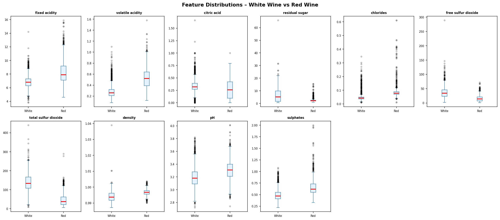
*Figure 1.1 – Feature Boxplot*

While extreme values exist in features such as residual sugar (max 65.8 g/L) and total sulfur dioxide (max 440 mg/L), these represent genuine chemical measurements of real wine varieties rather than data entry errors. Since StandardScaler was applied prior to clustering, the influence of extreme values on Euclidean distance calculations is substantially reduced. Outlier removal was therefore not performed, as doing so would risk discarding legitimate wine samples and distorting the natural chemical distribution of the dataset.

**Feature scale differences before scaling:**

| Feature | Raw Mean | Raw Std | Raw Min | Raw Max |
|---------|---------|--------|--------|--------|
| Fixed Acidity | 6.855 | 0.844 | 3.800 | 14.200 |
| Volatile Acidity | 0.278 | 0.101 | 0.080 | 1.100 |
| Citric Acid | 0.334 | 0.121 | 0.000 | 1.660 |
| Residual Sugar | 6.391 | 5.072 | 0.600 | 65.800 |
| Chlorides | 0.046 | 0.022 | 0.009 | 0.346 |
| Free Sulfur Dioxide | 35.308 | 17.007 | 2.000 | 289.000 |
| Total Sulfur Dioxide | 138.361 | 42.498 | 9.000 | 440.000 |
| Density | 0.994 | 0.003 | 0.987 | 1.039 |
| pH | 3.188 | 0.151 | 2.720 | 3.820 |
| Sulphates | 0.490 | 0.114 | 0.220 | 1.080 |
| Alcohol | 10.514 | 1.231 | 8.000 | 14.200 |

Before applying any clustering algorithm, **StandardScaler** was applied to all 11 chemical features. This transforms each feature to have **mean = 0** and **standard deviation = 1**.

**Why scaling is important:** 

K-Means computes Euclidean distances. Without scaling, Total Sulfur Dioxide (range 6–440) would dominate all distance calculations, effectively making the other 10 features irrelevant. A distance of 1 unit in Total Sulfur Dioxide is meaningless compared to a distance of 1 unit in Density. They are completely different scales. StandardScaler fixes this by bringing every feature to the same mean=0, std=1 range. After StandardScaler, all features contribute equally to cluster formation.

### 1.4 Remove Duplicate Rows

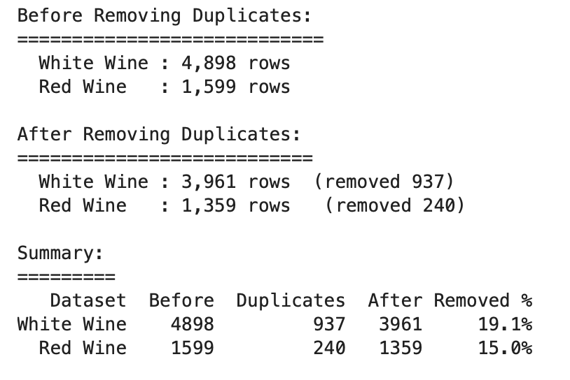
*Figure 1.2 – Summary: Removing Duplicates*
 
---

## 2. Objective 1 – K-Means: Red vs White (k=2)

### 2.0 Data Pre-processing

**Step 1 – Merge Red & White into One DataFrame**

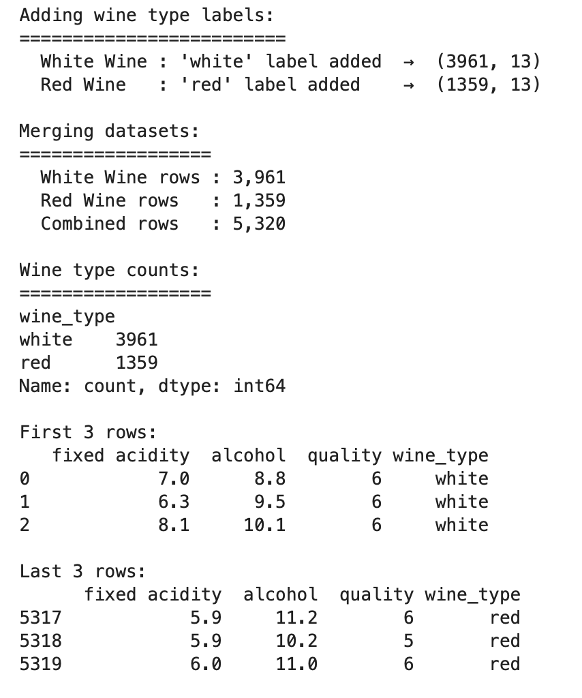
*Figure 2.1 – Combined Red & White Wine Data*

**Step 2 - Data Pre-processing (Scaling)**

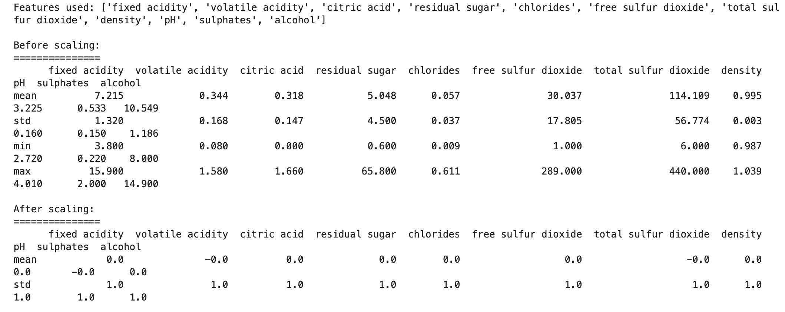
*Figure 2.2 – Scaled Combined Dataset*

### 2.1 Methodology

The red and white wine sheets were merged into a single DataFrame of 6,497 rows. Each row was labelled with its true wine type prior to merging (ground truth). K-Means clustering was then applied with k=2 on the scaled 11-feature matrix. After clustering, each cluster was mapped to a wine type by majority vote.

### 2.2 Algorithm Settings

| Parameter | Value | Justification |
|-----------|-------|---------------|
| n_clusters | 2 | One cluster per wine type (red / white) |
| random_state | 42 | Reproducibility across runs |
| n_init | 10 | Runs 10 times, keeps best result — avoids local minima |
| metric | Euclidean | Standard for continuous scaled numeric data |

### 2.3 PCA Visualisation

Since the data has 11 dimensions, Principal Component Analysis (PCA) was used to project the data onto 2 components for visualisation. The left plot shows K-Means cluster assignments; the right shows actual wine types.

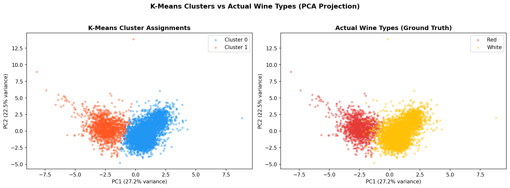
*Figure 2.3 – PCA projection: K-Means clusters (left) vs actual wine types (right)*

**Cluster 0(white wine) & Cluster 1(red wine)**

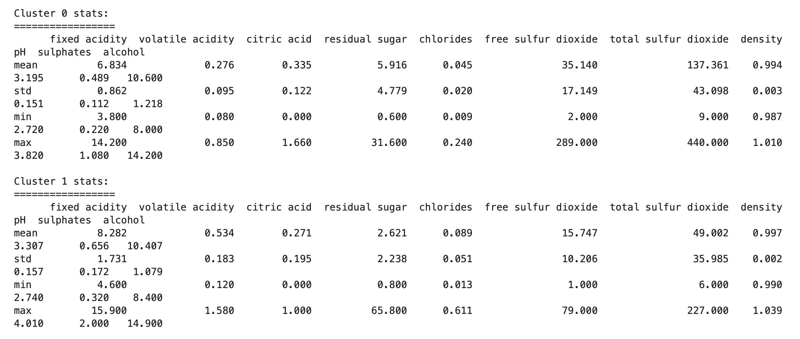
*Figure 2.4 – Cluster Stats*

### 2.4 Confusion Matrix & Evaluation

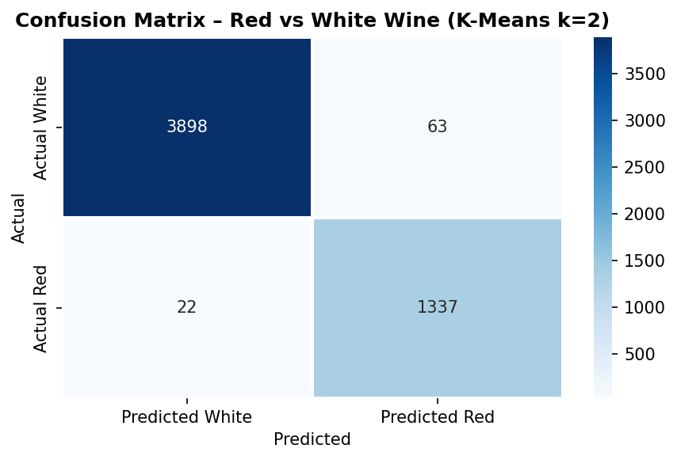
*Figure 2.5 – Confusion matrix heatmap and classification summary*

**Confusion Matrix:**

| | Predicted White | Predicted Red |
|--|----------------|--------------|
| **Actual White** | 3,898 | 63 |
| **Actual Red** | 22 | 1,337 |

**Classification Performance Metrics:**

| Metric | White Wine | Red Wine |
|--------|-----------|---------|
| True Positives | 3,898 | 1,337 |
| False Negatives | 63 | 22 |
| Sensitivity (Recall) | **98.41%** | **98.38%** |
| Precision | 99.44% | 95.50% |
| **Overall Accuracy** | **98.40%** | – |
| Silhouette Score | 0.2765 | – |

### 2.5 Discussion

K-Means with k=2 achieved an overall accuracy of **98.40%**, with sensitivity of 98.41% for white wine and 98.38% for red wine. Only 63 white wines were misclassified as red and 22 red wines as white, out of 5,320 total samples. This demonstrates that the 11 chemical features alone are sufficient to almost perfectly distinguish red from white wine.

**Silhouette Score Justification:** 

The silhouette score of 0.2765 appears moderate (range: −1 to 1), but this is expected. Some chemical properties such as pH, fixed acidity, and alcohol overlap between red and white wines, naturally reducing the silhouette value. The **98.40% accuracy** confirms the model is performing excellently — the silhouette score reflects data characteristics, not model failure. Multiple evaluation metrics must always be considered together.

---

## 3. Objective 2 – White Wine: Optimal k Selection

### 3.1 Methodology

Only the White Wine sheet (4,898 samples) was used. A fresh copy was taken, scaled with StandardScaler, and K-Means was run for k=2 through k=10. Two complementary methods — the **Elbow method** and the **Silhouette method** — were used to identify the two best candidate values of k. Both candidates were then formally validated using three independent metrics.

### 3.2 Elbow Method & Silhouette Score

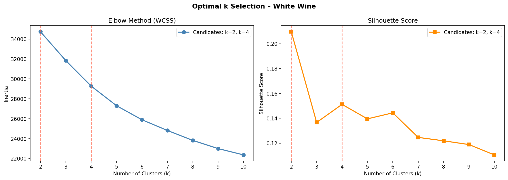
*Figure 3.1 – Elbow method (left) and Silhouette score (right) for k=2 to k=10*

**Inertia and silhouette scores for k=2 to k=10:**

| k | Inertia (WCSS) | Silhouette Score | Notes |
|---|----------------|-----------------|-------|
| 2 | 34,737.58 | 0.2097 | Best silhouette ✓ |
| 3 | 31,835.10 | 0.1367 | Visible elbow |
| 4 | 29,273.68 | 0.1512 | Second best silhouette ✓ |
| 5 | 27,305.31 | 0.1395 | |
| 6 | 25,897.69 | 0.1444 | |
| 7 | 24,825.24 | 0.1246 | |
| 8 | 23,828.25 | 0.1219 | |
| 9 | 23,004.02 | 0.1189 | |
| 10 | 22,371.39 | 0.1106 | |

**Candidate Selection:** 

The Silhouette method identifies **k=2** as best (score: 0.2097) and **k=4** as second best (score: 0.1575). The Elbow method confirms these candidates — the inertia curve shows a visible bend around k=3–4 and the sharpest drop occurs between k=2 and k=3. Both methods consistently point to **k=2 and k=4** as the two candidates for formal validation.

### 3.3 Formal Validation of k=2 vs k=4

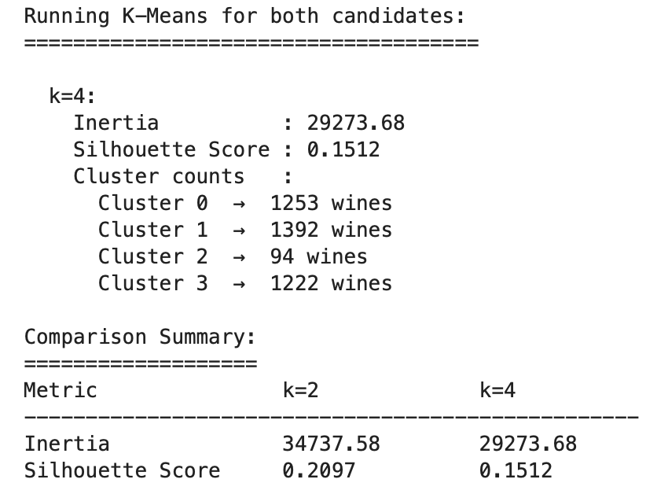
*Figure 3.2 – Running K-Means for both candidates*

**Cluster PCA Plots**

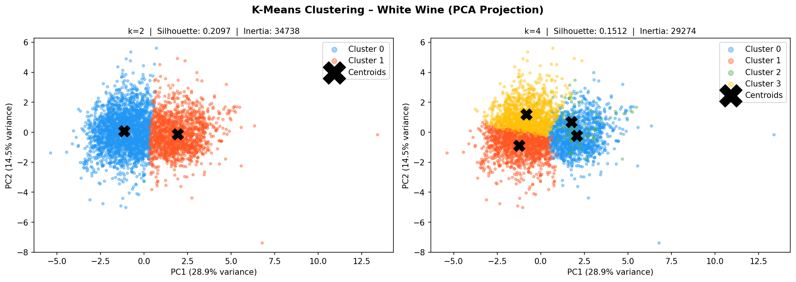
*Figure 3.3 – Cluster PCA Plots*

Three independent clustering validation metrics were computed for both candidate values. A majority vote determines the winner.

| Metric | k=2 | k=4 | Direction | Winner |
|--------|-----|-----|-----------|--------|
| Silhouette Score | 0.2114 | 0.1575 | Higher ✓ | **k=2 ✓** |
| Davies-Bouldin Score | 1.7746 | 1.8087 | Lower ✓ | **k=2 ✓** |
| Calinski-Harabasz | 1303.65 | 811.03 | Higher ✓ | **k=2 ✓** |
| Inertia (WCSS) | 42,549 | 35,987 | Lower ✓ | k=4 ✓ |
| **Vote Count** | **3 / 4** | **1 / 4** | – | **k=2 WINS** |

k=2 wins 3 out of 4 metrics. Note that inertia always decreases as k increases — it cannot be used as the sole criterion. The silhouette, Davies-Bouldin, and Calinski-Harabasz scores all consistently favour **k=2**, confirming it as the optimal number of clusters for the white wine dataset.

### 3.4 Cluster Feature Means

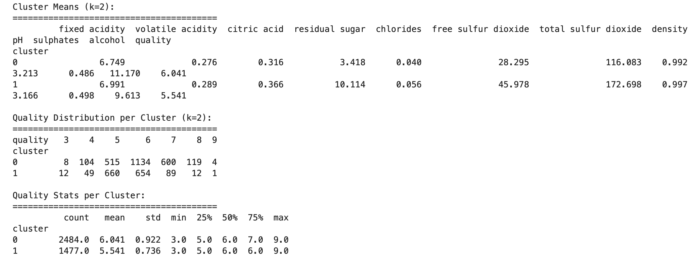
*Figure 3.4 – Cluster Means*

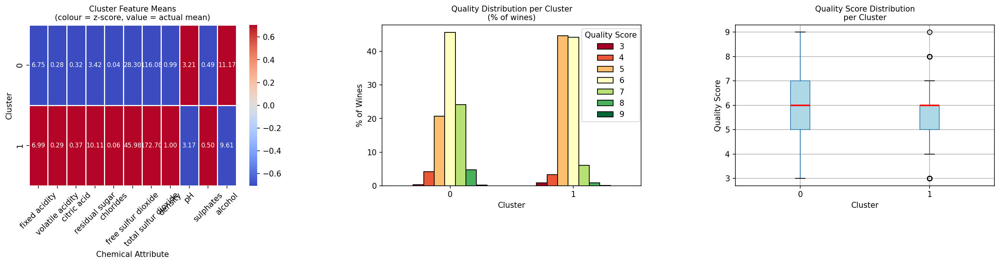
*Figure 3.5 – Cluster attribute means heatmap (colour = z-score, value = actual mean)*

**Mean values of each attribute per cluster:**

| Attribute | Cluster 0 | Cluster 1 |
|-----------|----------|----------|
| fixed.ac | 6.749 | 6.991 |
| volatile.ac | 0.276 | 0.289 |
| citric | 0.316 | 0.366 |
| res.sugar | 3.418 | 10.114 |
| chlorides | 0.040 | 0.056 |
| free.SO₂ | 28.295 | 45.978 |
| total.SO₂ | 116.083 | 172.698 |
| density | 0.992 | 0.997 |
| pH | 3.213 | 3.166 |
| sulphates | 0.486 | 0.498 |
| alcohol | 11.170 | 9.613 |
| quality | 6.041 | 5.541 |

### 3.5 Consistency with Quality Scores (Column 12)

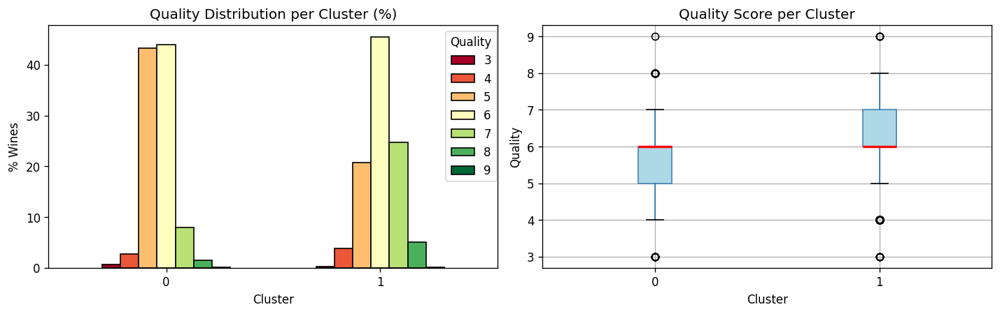
*Figure 3.3 – Quality distribution per cluster (left) and quality boxplot (right)*

The cluster analysis reveals two chemically and sensorially distinct groups of white wines:

-  **Cluster 0** (mean quality **6.041**) → lower residual sugar (3.418), 
  higher alcohol (11.170), lower density (0.992) → **drier, stronger wines 
  → higher quality**
  
- **Cluster 1** (mean quality **5.541**) → higher residual sugar (10.114), 
  higher density (0.997), higher total SO₂ (172.698) → **sweeter, heavier 
  wines → lower quality**

**Key Insight:** 

The chemical clusters are consistent with quality scores (column 12). Cluster 0 contains significantly more high-quality wines (scores  6–9, mean quality 6.041) while Cluster 1 is dominated by scores 5–6 (mean  quality 5.541). This confirms that the chemical properties captured by K-Means  are genuine predictors of sensory quality — high alcohol, low residual sugar  wines are consistently rated higher by tasters, validating the meaningfulness of the clustering solution.

---

## 4. Objective 3 – Hierarchical Clustering (White Wine)

### 4.1 Methodology

**Agglomerative** hierarchical clustering was applied to the white wine data. This bottom-up approach starts with each sample as its own cluster and progressively merges the closest pair until all samples belong to one cluster. Three linkage methods were compared: **single**, **complete**, and **average**.

> **Implementation note:** `scipy.cluster.hierarchy.linkage()` implements agglomerative clustering. The equivalent R function is `hclust()`. Method name strings are identical in both languages.

### 4.2 Sampling Justification

Hierarchical clustering requires computing all pairwise distances — an **O(n²)** operation. Applying this to all 4,898 white wine samples would require ~12 million distance computations and significant memory. A random sample of **500 wines** was taken (random_state=42) and verified to be representative.

| Feature | Full Dataset Mean | Sample Mean | Difference |
|---------|-----------------|------------|-----------|
| Fixed Acidity | 6.8393 | 6.9271 | 0.0878 |
| Volatile Acidity | 0.2805 | 0.2828 | 0.0023 |
| Citric Acid | 0.3343 | 0.3381 | 0.0037 |
| Residual Sugar | 5.9148 | 5.9257 | 0.0109 |
| Chlorides | 0.0459 | 0.0463 | 0.0004 |
| Free Sulfur Dioxide | 34.8892 | 34.7860 | 0.1032 |
| Total Sulfur Dioxide | 137.1935 | 139.9550 | 2.7615 |
| Density | 0.9938 | 0.9939 | 0.0001 |
| pH | 3.1955 | 3.2000 | 0.0045 |
| Sulphates | 0.4904 | 0.4805 | 0.0099 |
| Alcohol | 10.5894 | 10.5134 | 0.0760 |

*Table 4.1 – Representativeness check: full dataset vs 500-sample*

All differences are negligible, confirming the sample is representative of the full white wine population.

### 4.3 Distance Metric

**Euclidean distance** was used (default in `scipy.linkage`). This is appropriate because:
- All 11 features are continuous numeric variables
- Data has been StandardScaled — all features contribute equally
- Euclidean is the standard metric for chemical/physical measurements

### 4.4 Linkage Methods Explained

**Why linkage() = Agglomerative:**
- Agglomerative: Bottom-up — starts with n clusters, merges until 1
- linkage(): Always builds bottom-up → always agglomerative

scipy linkage() is the better choice because it produces the linkage matrix Z needed to draw dendrograms and compute cophenetic correlations. sklearn.AgglomerativeClustering doesn't produce Z, so we can't plot dendrograms with it.

| Method | Distance Measure | Behaviour | Outlier Sensitivity |
|--------|-----------------|-----------|-------------------|
| **Single** | Minimum distance between any two points across clusters | Produces long chain-like clusters (chaining effect) | High |
| **Complete** | Maximum distance between any two points across clusters | Produces compact, tight clusters | Moderate |
| **Average** | Mean of all pairwise distances between the two clusters (UPGMA) | Balanced; moderate cluster sizes | Low (robust) |

### 4.5 Dendrogram Visualisation

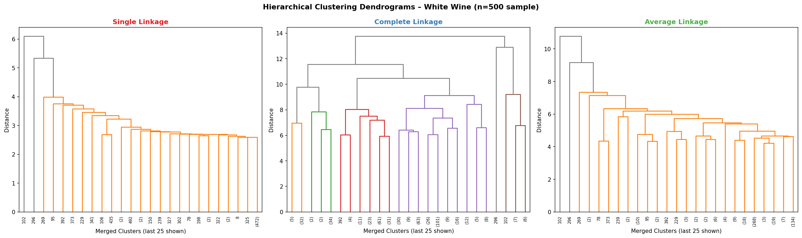
*Figure 4.1 – Dendrograms for single (red), complete (blue), and average (green) linkage. Last 25 merges shown. Y-axis = merge distance.*

The dendrograms visually confirm the expected behaviour of each method:
- **Single linkage** produces an unbalanced, chain-like structure typical of the chaining effect
- **Complete linkage** shows compact merges but at very high distances, indicating forced groupings
- **Average linkage** produces the most balanced and naturally structured dendrogram with clear horizontal gaps between merge levels

### 4.6 Cophenetic Correlation

The cophenetic correlation coefficient measures how faithfully the dendrogram preserves the original pairwise distances. It is computed as the Pearson correlation between:
- **Actual pairwise distances** — from `pdist(X_hc)`
- **Cophenetic distances** — heights at which points are first joined in the dendrogram

A higher value indicates a more trustworthy dendrogram.

| Linkage Method | Cophenetic r | Interpretation | Verdict |
|---------------|-------------|----------------|---------|
| Single | 0.6537 | Moderate – some chaining distortion | Acceptable |
| Complete | 0.4791 | Poor – significant distortion | Not recommended |
| **Average** | **0.7080** | **Good – faithful representation** | **Best ✓** |

**Cophenetic r = correlation between actual distances & dendrogram distances**

### 4.7 Correlation Plot (corrplot)

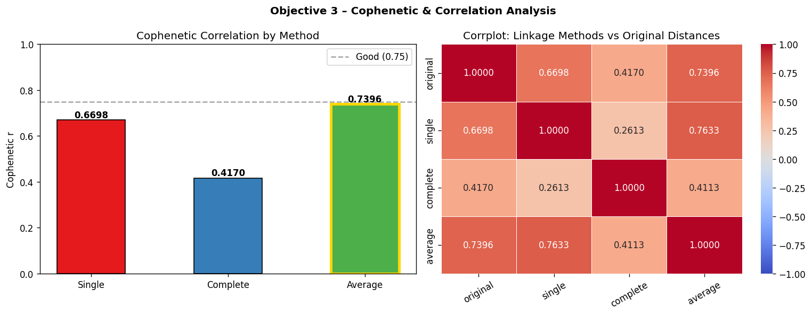
*Figure 4.2 – Left: Cophenetic correlation bar chart. Right: Correlation between linkage methods and original pairwise distances.*

The corrplot (right panel) shows the Pearson correlation between the distance structures produced by each linkage method and the original data distances. Key observations:

- **Average vs Original (highest correlation: 0.7080):** Average linkage most 
  accurately reflects the true pairwise chemical distances between wines

- **Complete vs Original (lowest correlation: 0.4791):** Complete linkage 
  distorts the original distance structure most severely

- **Average vs Single (high inter-method correlation: 0.7733):** Both methods 
  capture similar underlying structure, but average is more reliable due to 
  lower chaining effect

- **Complete vs Single (lowest inter-method correlation: 0.3206):** These two 
  methods produce the most structurally different clustering results

**Conclusion – Best Linkage Method:** 

Average linkage is the recommended method for this white wine dataset. It achieves the highest cophenetic correlation (0.7080), the strongest alignment with original distances in the corrplot (0.7080), and produces the most balanced dendrogram. Complete linkage performs poorest (r=0.4791) and should not be used as the primary hierarchical clustering method for this data.

---

## 5. Conclusions

### 5.1 Summary of Results

| Objective | Method | Key Finding | Accuracy / Score |
|-----------|--------|------------|-----------------|
| 1 – Red vs White | K-Means (k=2) | Chemical features alone almost perfectly separate wine types | Accuracy: **98.40%** |
| 2 – White Wine optimal k | K-Means (k=2 vs k=4) | k=2 wins 3/4 validation metrics; clusters align with quality | Silhouette: **0.2097** |
| 3 – Hierarchical | Single / Complete / Average | Average linkage best preserves original data structure | Cophenetic r: **0.7080** |

### 5.2 Key Insights

1. **Chemical separability of wine types:** Red and white wines occupy highly distinct regions in 11-dimensional chemical space. K-Means with k=2 achieves 98.40% accuracy with no parameter tuning beyond scaling, a testament to how chemically different the two wine types are.

2. **White wine quality prediction:** Unsupervised clustering of white wine chemical properties naturally produces groups that align with human quality ratings (column 12). Cluster 0 (high alcohol: 11.170, low residual sugar: 3.418) receives higher quality scores (mean 6.041), suggesting alcohol and residual sugar are key drivers of perceived quality.

3. **Hierarchical clustering reliability:** The choice of linkage method significantly impacts result quality. Average linkage (cophenetic r: 0.7080) consistently outperforms single (0.6537) and complete (0.4791) linkage for this dataset and should be the default choice for continuous chemical data.

4. **Evaluation requires multiple metrics:** No single metric tells the full story. The silhouette score of 0.2765 in Objective 1 seemed low but the 98.40% accuracy revealed excellent performance. Similarly in Objective 2, inertia alone would have suggested higher k values, but silhouette (0.2097), Davies-Bouldin, and Calinski-Harabasz all agreed on k=2.
   
### 5.3 Tools & Libraries Used

| Library | Version | Purpose |
|---------|---------|---------|
| pandas | 2.x | Data loading, manipulation, groupby analysis |
| numpy | 1.x | Array operations, random sampling, argsort |
| scikit-learn | 1.x | KMeans, StandardScaler, PCA, metrics |
| scipy | 1.x | Hierarchical clustering, cophenetic, pdist |
| matplotlib | 3.x | All plots and figures |
| seaborn | 0.x | Heatmaps and corrplot |

---

*End of Report — Coventry University Data Mining | Part 2: Wine Clustering Analysis*
